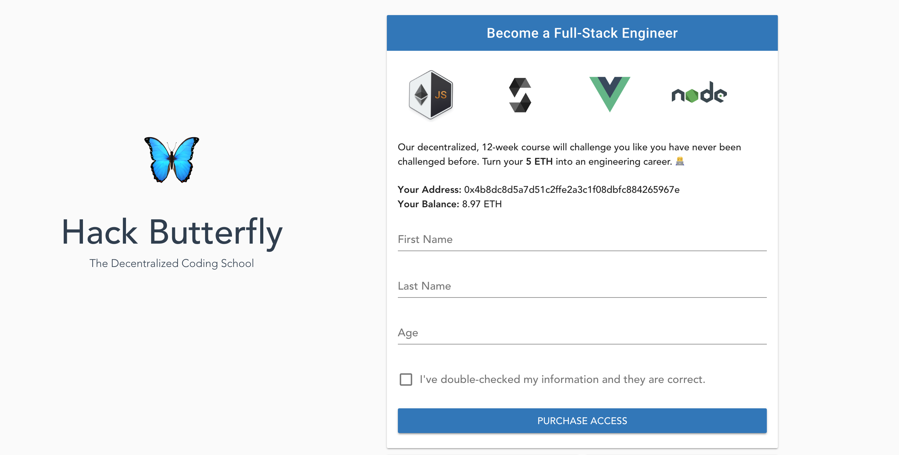

# Hack Butterfly

<p align="center">
  
</p>

## Table of Contents

- [Introduction](#introduction)
- [Features](#features)
- [Feedback](#feedback)


## Introduction

[](http://makeapullrequest.com)

Do you struggle to keep up with the Meta? No idea what a funnel strat is? We have you covered! MetaTV is an esports VOD platform with high-elo commentary to help you understand what's going on. 
This was created during my time as a student at Code Chrysalis using Nuxt (SSR Vue), Node, Knex, and Postgres.
[You can check out the demo here!](https://morning-oasis-55449.herokuapp.com//)

## Features

Current and future feature set:

* Watch VOD from YouTube
* Commentary appears over time, based on the video's timestamp. (no spoilers!)
* High elo players can add a new commentary.
* Vuetiful!

Coming soon™: 

* Login and permission (noone wants to read bronze commentary)
* More videos!
* Up / downvotes on comments
* Being able to draw on the video (I know, that would be so cool!)

## Feedback

Feel free to send me feedback on [Discord](https://discordapp.com/users/Akzent#6791) or [file an issue](https://github.com/makzent/metatv/issues/new). Feature requests are always welcome. If you wish to contribute, please feel free to add a pull request. 

If there's anything you'd like to chat about, just add me on Discord and let's talk! 


## Project setup

After you cloned the project, run:
```
yarn
```

### Compiles and hot-reloads for development
```
yarn run serve
```

### Compiles and minifies for production
```
yarn run build
```

### Lints and fixes files
```
yarn run lint
```
